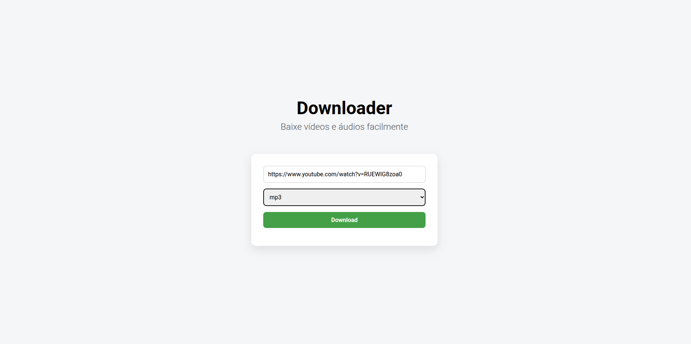
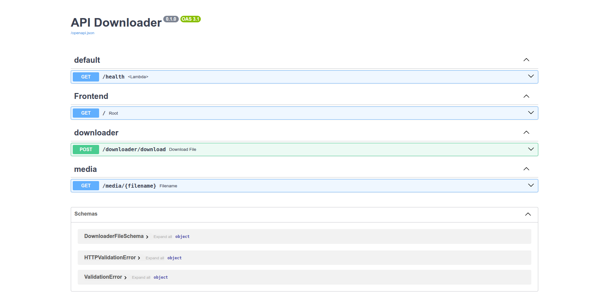

# Downloader
Aplicação em FastAPI para baixar vídeos e músicas facilmente

## Descrição

Esta aplicação em FastAPI permite rodar um microserviço com função de baixar vídeos e músicas
utilizando a biblioteca **yt-dlp** de forma simples e descomplicada, bastando apenas inserir
a URL do vídeo ou música que deseja baixar e escolher o formato de saída (mp3, wav, mp4, webm e mkv).

---

## Instalação

Siga os passos abaixo para instalar localmente a aplicação.
No entanto, é necessário primeiro ter as seguintes aplicações instaladas:

- git
- Python 3.12+
- VirtualenvWrapper ou Conda (ou qualquer outra aplicação de ambientes virtuais)
- ffmpeg
- Makefile (Opcional)

### 1. Clone o projeto em sua máquina:

```bash
$ git clone https://github.com/Wolfterro/Downloader.git
```

### 2. Crie uma virtualenv para o projeto:

```bash
$ virtualenvwrapper downloader --python=python3.12
```

ou

```bash
$ conda create -n downloader --python=python3.12
```

### 3. Instale as dependências do projeto:

```bash
(downloader) $ pip install -r requirements.txt
```

### 4. Crie um arquivo .env e preencha da seguinte forma:

```bash
(downloader) $ echo "HOSTNAME=<ENDEREÇO OU IP AQUI>" >> .env
```

Exemplo: 

```env
HOSTNAME=http://127.0.0.1:8000
```


### 5. Rode a aplicação utilizando um dos comandos abaixo:

```bash
(downloader) $ make run
```

ou

```bash
(downloader) $ uvicorn main:app --host 0.0.0.0 --port 8000 --reload
```

Depois disso, sua aplicação deverá estar rodando na porta 8000.

- Página principal: http://127.0.0.1:8000/
- Docs: http://127.0.0.1:8000/docs

---

## Screenshots

Página principal:
</img>

Docs:
</img>

## Licença

Este projeto está sob as regras da licença MIT.